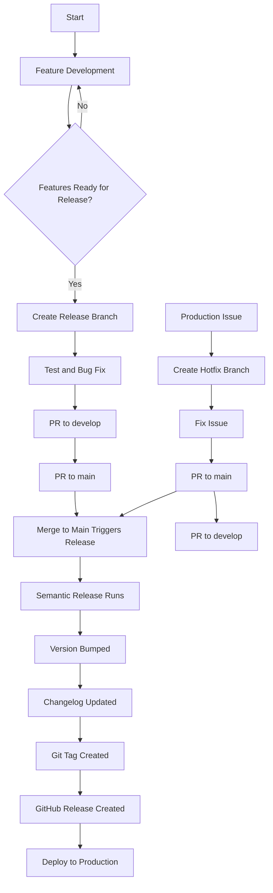

# Release Workflow Visual Guide

## Branching Strategy

```
main              ----o----------------o-----------------o------>
                      |                |                 |
                      |                |                 |
                      |                |                 |
develop          --o--o----o----o-----o-----o-----o-----o------>
                    |      |    |     |     |     |     |
                    |      |    |     |     |     |     |
feature/x      -----o------o----|     |     |     |     |
                           |    |     |     |     |     |
feature/y           -------o----o-----|     |     |     |
                                |     |     |     |     |
                                |     |     |     |     |
release/1.0.0                   ------o-----o-----|     |
                                            |     |     |
hotfix/abc                                  ------o-----|
```

## Release Process Flow



## Roles and Responsibilities

| Role | Responsibilities |
|------|-----------------|
| Developer | • Create feature branches<br>• Write code with conventional commits<br>• Create PRs to develop<br>• Review code from other developers |
| Tech Lead | • Review PRs to develop<br>• Create release branches<br>• Coordinate release timing |
| Release Manager | • Verify release candidates<br>• Approve PRs to main<br>• Monitor release process<br>• Coordinate deployment |
| DevOps | • Maintain CI/CD pipelines<br>• Configure branch protection<br>• Manage deployment automation |

## Commit and Versioning Rules

| Commit Type | What It Does | Version Impact |
|-------------|--------------|---------------|
| `feat:`     | New feature | MINOR (1.x.0) |
| `fix:`      | Bug fix | PATCH (1.0.x) |
| `docs:`     | Documentation only | No version change |
| `style:`    | Code formatting | No version change |
| `refactor:` | Code refactoring | No version change |
| `perf:`     | Performance improvement | PATCH (1.0.x) |
| `test:`     | Add/update tests | No version change |
| `chore:`    | Build/tooling changes | No version change |
| `BREAKING CHANGE:` | (in commit body) | MAJOR (x.0.0) |

## Release Command Summary

| Phase | Command | Description |
|-------|---------|-------------|
| Feature Start | `git checkout -b feature/name` | Create feature branch |
| Feature End | Create PR to develop | Via GitHub UI |
| Release Start | `./scripts/create-release.sh` | Create release branch |
| Release End | Create PR to main | Via GitHub UI with label |
| Hotfix Start | `git checkout -b hotfix/name main` | Create hotfix from main |
| Hotfix End | Create PRs to main and develop | Via GitHub UI |